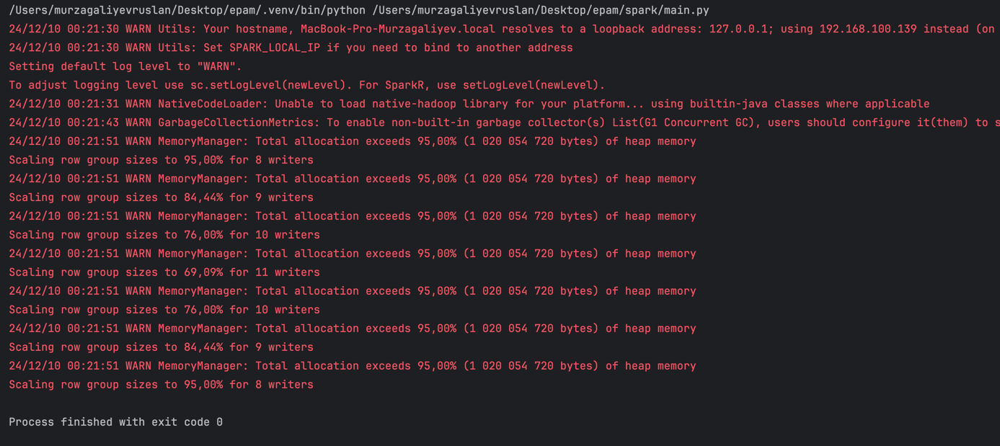

<!DOCTYPE html>
<html lang="en">
<head>
<meta charset="UTF-8">
<title>Spark Practice ETL Task</title>
</head>
<body>
<h1>Spark Practice ETL Task</h1>

<h2>Prerequisites</h2>
<ul>
  <li>Python 3.8 or higher</li>
  <li><a href="https://spark.apache.org/">Apache Spark</a> (tested with Spark 3.x)</li>
  <li>A valid <a href="https://opencagedata.com/" target="_blank">OpenCage API key</a></li>
  <li>Installed Python packages: <code>pyspark</code>, <code>requests</code>, <code>geohash2</code>, <code>pyspark</code></li>
</ul>
<pre><code>pip install pyspark requests geohash2
</code></pre>

<h2>Data Layout</h2>

<h3>Restaurants:</h3>

Input data: CSV files under <code>data/restaurants/</code> (e.g., <code>part-00000-...csv</code>, etc.).

Columns include: <code>id, franchise_id, franchise_name, restaurant_franchise_id, country, city, lat, lng</code>.

<h3>Weather:</h3>

Input data: Partitioned Parquet files under <code>data/weather/</code> with a structure like <code>year=.../month=.../day=...</code>.

Columns include: <code>lat, lng, avg_tmpr_f, avg_tmpr_c, wthr_date</code>.

<h2>Steps Performed by the Job</h2>
<ol>
  <li><strong>Read Restaurant Data:</strong> The job reads all CSV files from <code>data/restaurants</code> into a Spark DataFrame.</li>
  <li><strong>Split Data by Coordinate Availability:</strong> The DataFrame is split into two:
    <ul>
      <li><code>no_null_df</code>: Rows with existing <code>lat</code> and <code>lng</code>.</li>
      <li><code>null_df</code>: Rows missing <code>lat</code> or <code>lng</code>.</li>
    </ul>
  </li>
  <li><strong>Geocoding Missing Coordinates:</strong> For each record in <code>null_df</code>, the job calls the OpenCage Geocoding API to obtain coordinates based on the <code>city</code> and <code>country</code>.
    If coordinates are found, they are assigned to the record.
    This ensures that ultimately every record has valid coordinates.
  </li>
  <li><strong>Combine Fixed and Non-null Data:</strong> After geocoding, we combine <code>no_null_df</code> (original records with coordinates) and <code>null_fixed_df</code> (previously missing coordinates, now populated) into a single DataFrame. All restaurants now have final coordinates.</li>
  <li><strong>Generate Geohash for Restaurants:</strong> Using the <code>geohash2</code> library, a 4-character geohash is generated for each restaurant’s coordinates. A new column, <code>geohash</code>, is added.</li>
  <li><strong>Read Weather Data &amp; Generate Geohash:</strong> Weather data is read from <code>data/weather</code> (Parquet format). A 4-character geohash is computed from its <code>lat</code> and <code>lng</code>.
    Any duplicates by <code>geohash</code> in the weather data are removed to prevent data multiplication when joining.
  </li>
  <li><strong>Join Restaurant and Weather Data:</strong> Perform a left-join on the <code>geohash</code> column, ensuring that each restaurant is enriched with corresponding weather information.</li>
  <li><strong>Write Enriched Data:</strong> The final enriched DataFrame, containing all the restaurant and weather fields, is written to <code>data/output/enriched_final</code> in Parquet format, partitioned by <code>geohash</code>.</li>
</ol>

<h2>Running the Job</h2>
<ol>
  <li><strong>Set your OpenCage API key:</strong>
    <pre><code>API_KEY = "YOUR_OPENCAGE_API_KEY"
</code></pre>
  </li>
  <li><strong>Ensure Input Data:</strong> Make sure <code>data/restaurants</code> and <code>data/weather</code> contain the expected input files.</li>
  <li><strong>Run the Spark job:</strong>
    <pre><code>spark-submit --master local[*] main.py
</code></pre>
    The job will read and process the data, enrich the restaurant data with weather information, and write the result to <code>data/output/enriched_final</code>.
  </li>
</ol>

<h2>Screenshots &amp; Documentation</h2>

<h2>Repository Structure</h2>
<ul>
  <li><code>main.py</code>: The main Spark job script.</li>
  <li><code>data/</code>: Directory containing <code>restaurants</code> and <code>weather</code> subdirectories.</li>
  <li><code>data/output/</code>: Directory for the output Parquet files.</li>
  <li><code>README.md</code>: This documentation file.</li>
  <li><code>tests/</code>: Directory containing test scripts and mock data.</li>
</ul>

––</body>
</html>